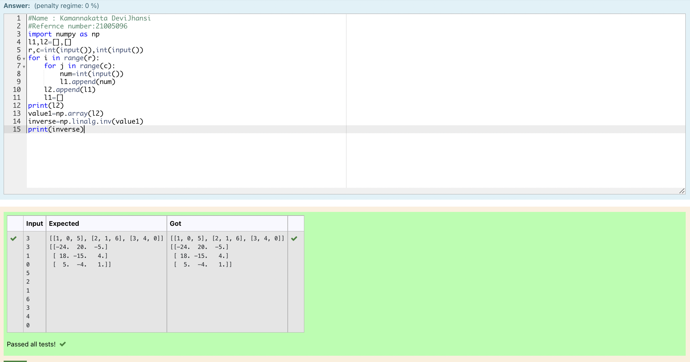

# Inverse-of-matrix

## AIM:
To inverse the matrix.
## ALGORITHM:
### Step 1:
Import numpy as np.
### Step 2:
Create an empty list.
### Step 3:
Get inputs from the user.
### Step 4:
Use inverse function.
### Step 5:
Run and End the program.

## PROGRAM:
```
#Name : Kamannakatta DeviJhansi
#Refernce number:21005096
import numpy as np
l1,l2=[],[]
r,c=int(input()),int(input())
for i in range(r):
    for j in range(c):
        num=int(input())
        l1.append(num)
    l2.append(l1)
    l1=[]
print(l2)
value1=np.array(l2)
inverse=np.linalg.inv(value1)
print(inverse)
```
## OUTPUT:

## RESULT:
Inverse of a matrix is successfully completed.